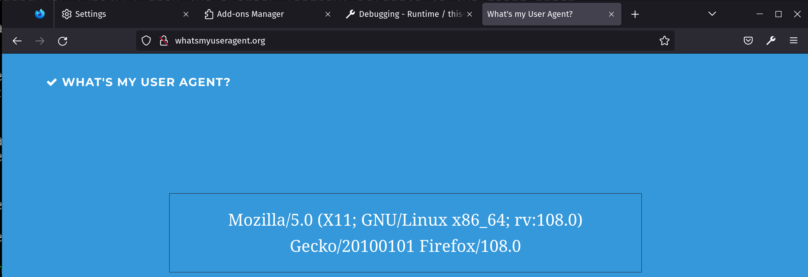

# gahnoo-linux.firefox.js

## What it does

This extension rewrites all your user-agents from `Linux` to `GNU/Linux`. It only has an effect if you're actually on Linux. It doesn't actually check if your Linux is GNU so will lie if you're on Alpine Linux (lol).

## Screenshot

